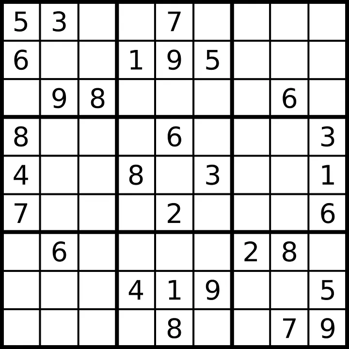
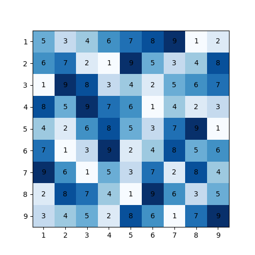

# Real-Time-Sudoku-Solver-

This project is a **Streamlit-based Sudoku Solver WebApp** that allows users to upload an image of an unsolved Sudoku puzzle, solves it using an algorithm, and provides the solved puzzle in both text and image formats for easy download.

Access the Web App 🌐
You can access the live version of the Sudoku Solver WebApp by clicking the link below:

🔗 [Sudoku Solver WebApp](https://real-time-sudoku-solver.streamlit.app/)

## Features ✨

- **UI Streamlit WebApp**: A user-friendly interface that allows users to upload an image of a Sudoku puzzle.
- **Sudoku Solver**: Solves the Sudoku puzzle using an algorithm.
- **Image Output**: The solved puzzle is displayed as an image, and users can download the image.

## Technologies Used 💻

- Python 🐍
- Streamlit 🚀
- OpenCV 🖼️
- Pytesseract (for text extraction from the image) 🔤
- NumPy 🔢

## About the Sudoku Solver Algorithm 🧠

The Sudoku solving algorithm uses a **backtracking** approach, which is a form of depth-first search. It tries possible numbers in the empty cells of the Sudoku grid and checks if the number violates Sudoku rules (i.e., no number repeats in any row, column, or subgrid). If a violation occurs, the algorithm backtracks and tries a different number.

## Example 🖼️

### Example Sudoku Puzzle:
(uploaded by the user)



### Solved Sudoku Puzzle:
(generated by the Sudoko Webapp and downloadable)

  


 ## Prerequisites ⚙️

Before running the app, ensure that you have the following installed:

- Python 3.7 or higher
- pip (for installing Python packages)

## Installation 🔧

1. Clone this repository:

   ```bash
   git clone https://github.com/yourusername/sudoku-solver-webapp.git
   cd sudoku-solver-webapp
   ```

2. Install the necessary dependencies:

   ```bash
   pip install -r requirements.txt
   ```

## How to Run 🏃‍♂️

To run the web app, navigate to the project directory and execute the following command:

```bash
streamlit run streamlit_app.py
```

The app will start running locally and you can access it via:

```
http://localhost:8501
```

## How It Works 🔍

1. **UI of Streamlit WebApp**: The Streamlit app provides a simple interface where users can upload an image of a Sudoku puzzle.
2. **Upload Image**: After uploading, the image is processed, and text is extracted from it using OCR (Optical Character Recognition) to detect the numbers in the grid.
3. **Solve Puzzle**: The extracted numbers are passed to a Sudoku-solving algorithm, which fills in the missing numbers.
4. **Display Solved Puzzle**: The solved puzzle is displayed on the webpage.
5. **Download Solved Puzzle**: Users can download the image of the solved Sudoku puzzle by clicking the "Download Solved Sudoku" button.

## Folder Structure 📂

```bash
Sudoku-Solver-WebApp/
├── Images/                  # Folder containing example images
│   ├── Puzzle.png           # Example unsolved Sudoku image
│   ├── Puzzle2.png          # Another unsolved Sudoku image
│   ├── Puzzle3.png          # Another unsolved Sudoku image
│   └── solved_sudoku_puzzle2.png  # Solved Sudoku image for Puzzle2
├── best_model.keras         # Saved model for solving Sudoku
├── digit-recognition-using-cnn.ipynb  # Jupyter notebook for digit recognition
├── requirements.txt         # Dependencies
├── streamlit_app.py         # Main Streamlit app file
```

## Usage 💡

1. **Upload Sudoku Image**: Upload an image of the unsolved Sudoku puzzle by clicking the "Upload Image" button.
2. **View Solved Puzzle**: Once the image is processed and the puzzle solved, the solved puzzle will appear on the screen.
3. **Download Solved Puzzle**: You can download the solved Sudoku puzzle image by clicking the "Download Solved Sudoku" button.

